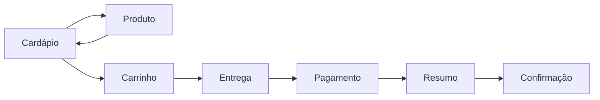

# Cardápio Digital — Revoada Lanches

Réplica visual e funcional (front-end apenas) de um cardápio digital de
hamburgueria no estilo dos grandes apps de delivery: navegação por
categorias, página de produto com adicionais configuráveis, carrinho,
endereço de entrega e forma de pagamento — tudo simulado no navegador,
sem nenhum backend real.

## Problema

Restaurantes pequenos costumam depender de plataformas de terceiros para
ter um cardápio digital com carrinho e checkout, pagando comissão por
pedido. Este projeto demonstra que a mesma experiência de uso — cardápio
com categorias, produto com adicionais, carrinho, endereço e pagamento —
pode ser construída como uma aplicação estática, leve e totalmente sob
controle do dono do negócio.

## Solução

Uma SPA (Single Page Application) em HTML/CSS/JS puro, sem framework e
sem build step, com roteamento por hash e todo o estado (carrinho,
endereço, forma de pagamento) mantido em memória e `localStorage`. Os
dados do cardápio ficam em um único arquivo (`js/data.js`). As fotos de
produto são imagens de banco gratuito (Pexels, uso livre sem atribuição
obrigatória) escolhidas para representar o estilo "lanche de podrão" —
prontas para serem substituídas pelas fotos reais do estabelecimento.

## Telas implementadas

- **Cardápio** — banner, dados da loja, navegação sticky por categorias, destaques ("Mais Pedidos") e listagem por categoria
- **Produto** — imagem, descrição, grupos de adicionais (escolha única e múltipla com limite), observações e contador de quantidade
- **Carrinho** — itens com adicionais escolhidos, sugestões ("Peça também"), edição de quantidade
- **Entrega** — escolha entre entrega/retirada e cadastro de endereço (cidade → região → detalhes)
- **Pagamento** — formas online (Pix, cartão, Apple/Google Pay) e na entrega (dinheiro, cartão, vale)
- **Resumo e confirmação** — totais do pedido e tela final de confirmação simulada

## Stack

| Camada | Tecnologia |
| --- | --- |
| Estrutura | HTML5 |
| Estilo | CSS puro (design system próprio, mobile-first) |
| Comportamento | JavaScript vanilla (sem framework, sem build step) |
| Estado | Objeto em memória + `localStorage` para o carrinho |
| Persistência de pedidos | Nenhuma — checkout é inteiramente simulado |

## Como rodar

Não há build nem dependências. Basta servir a pasta como arquivos
estáticos:

```bash
npx http-server -p 8080 -s
# depois abra http://localhost:8080/index.html
```

## Estrutura



## Personalização

- Troque as imagens em `assets/products/` e `assets/banner/` pelas fotos reais do estabelecimento (mesma proporção das atuais).
- Edite `js/data.js` para ajustar cardápio, categorias, preços e adicionais.
- Cores e tipografia ficam centralizadas em `:root` no topo de `css/style.css`.

## Créditos de imagem

Fotos de produto e banner: banco de imagens gratuito [Pexels](https://www.pexels.com)
(licença livre para uso comercial, sem atribuição obrigatória). São imagens
de banco para fins de demonstração — substitua pelas fotos reais do
estabelecimento antes de usar em produção.

## Licença

MIT — veja [LICENSE](LICENSE).
